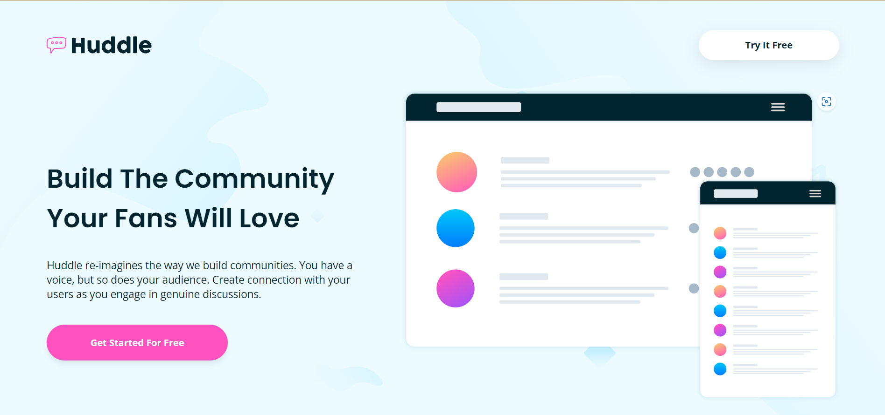
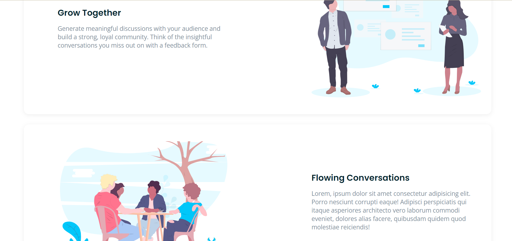
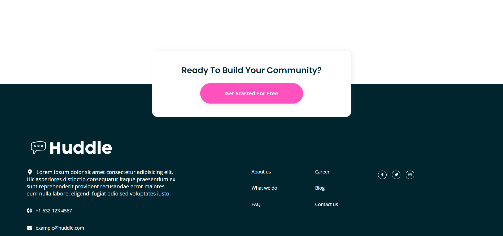

# Frontend Mentor - Huddle landing page with alternating feature blocks solution

This is a solution to the [Huddle landing page with alternating feature blocks challenge on Frontend Mentor](https://www.frontendmentor.io/challenges/huddle-landing-page-with-alternating-feature-blocks-5ca5f5981e82137ec91a5100). Frontend Mentor challenges help you improve your coding skills by building realistic projects.

## Table of contents

- [Overview](#overview)
  - [The challenge](#the-challenge)
  - [Screenshot](#screenshot)
  - [Links](#links)
- [My process](#my-process)
  - [Built with](#built-with)
  - [What I learned](#what-i-learned)
  - [Continued development](#continued-development)
- [Author](#author)

## Overview

### The challenge

Users should be able to:

- View the optimal layout for the site depending on their device's screen size
- See hover states for all interactive elements on the page

### Screenshot





### Links

- Live Site URL: [Add live site URL here](https://phenrique-gomes.github.io/huddle-landing-page-blocks--FrontEnd-Mentor/)

## My process

### Built with

- Semantic HTML5 markup
- CSS custom properties
- Flexbox
- CSS Grid
- Media queries

### What I learned

Through this project I was able to practice more my knowledge on CSS grid and Flexbox, and how to break the page in sections to try and make it easier to code or at least to make it less overwhelming to start it.

A very small part of the code that made me proud and that was actually my first time doing it, was when creating the responsive code, at the services section, the mobile version of the page has the images above the texts in all three services, while in the desktop version each service box has the image beside the texts and every each service the image is on the right and left side, at first glance on the design sheet I really didn't know how o approach that, but then suddenly I remmembered the "collumn-reverse" flexbox feature. I guess it's all about small victories.

To see how you can add code snippets, see below:

```css
.services .service.grow-together {
  display: flex;
  flex-direction: column-reverse;
}
```

### Continued development

I still want to focus a little more on the Grid feature, there are a lot of different ways to use and as many to write it, I think i need more practice to learn when use what, whether use "grid-area" or "grid-template-column" etc. , and even how to make eack column a different size when needed be. 

The flexbox feature is also a little tricky sometimes, I still have to get the hang of the parent/child specificities.

## Author

- Frontend Mentor - [@PHenrique-Gomes](https://www.frontendmentor.io/profile/PHenrique-Gomes)

